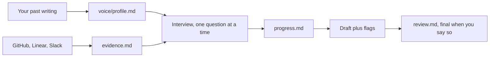

<h1 align="center">Review Harness</h1>

<p align="center"><em>Interview-driven performance reviews that sound like you.</em></p>

<p align="center">
  <a href="LICENSE"></a>
  <a href="docs/harnesses.md"></a>
  <a href="harness/principles.md"></a>
</p>

## Why

Reviews written from memory are vague. You sit down the night before the deadline, remember the last three weeks, and write "great team player" because the specifics from March are gone.

Asking an AI to write one produces slop. It has never met the person, so it pads. Every sentence could be pasted into someone else's review unchanged, and the reader can tell.

This harness does neither. It interviews you one question at a time and pushes for the situation, the effect and the counterexample. Before that, it pulls six months of real evidence from GitHub, Linear and Slack so the questions are concrete. Then it drafts in your voice, learned from your own past writing.

You stay in charge of every word. Nothing goes in that you did not say, the draft arrives with its own list of weak spots, and the review is final only when you say so.

## Sixty seconds to start

1. **Get a copy.** Click *Use this template* on GitHub and make the new repository private, or clone this one.
2. **Set up the workspace.** Open the folder in your harness and say "run review-setup". It asks who you are and who you review this cycle, then writes `workspace/`. Claude Code: `/review-setup`
3. **Teach it your voice.** Drop past reviews, written feedback or long messages into `workspace/voice/samples/`, then say "run review-voice". Claude Code: `/review-voice`
4. **Gather evidence.** Say "run review-evidence priya". Six months of PRs, tickets and messages, themed, every line linked. Claude Code: `/review-evidence priya`
5. **Interview and draft.** Say "run review peer priya". One question at a time, then a draft with its flags. Claude Code: `/review peer priya`

In other tools the same names work after `/`, after `$`, or in plain English. See [docs/harnesses.md](docs/harnesses.md).

## See it first

[examples/transcript.md](examples/transcript.md) is a condensed interview, from the opening line to "that is final". [examples/demo-workspace/](examples/demo-workspace/) is the finished workspace it produced: config, voice profile, evidence, progress notes and the review. Both are fictional. Ten minutes with them and you know what a good session looks like.

## What it produces

```
workspace/cycles/2026-h2/priya/
├── progress.md     interview state: status, ticked questions, your confirmed notes
├── evidence.md     what GitHub, Linear and Slack showed, themed, every line linked
├── notes.md        whatever you dropped in by hand during the cycle
└── review.md       the draft, then the final review
```

`progress.md` is the resume state. Every confirmed answer is saved there before the next question is asked, so you can close the laptop mid-interview and pick up a week later from the first unanswered question.

## How it works

1. `AGENTS.md` is the entrypoint. Every harness reads it, directly or through a one-line import such as `CLAUDE.md`.
2. All logic is plain markdown under `harness/`: the principles, one workflow per command, the question formats, the source recipes, the templates.
3. Each harness gets a thin adapter that says "follow `harness/workflows/review.md`" and nothing else. No logic is duplicated.
4. Your data lives in `workspace/`: config, people, voice profile, and one folder per review per cycle.
5. Every draft is checked against the writing rules and your voice profile before you see it, and comes with flags for what is vague, contradictory, too soft or too harsh.

The long version is in [docs/how-it-works.md](docs/how-it-works.md).



## Commands

| Command | What it does |
|---|---|
| `review <type> <slug>` | Start or resume a performance review interview (self, peer, manager, report, followup, or a custom format) and draft the review in your own voice. |
| `review-setup` | Create or extend a workspace: config, people, cycle folders. First run or new cycle. |
| `review-evidence <slug>` | Gather evidence of a person's work from GitHub, GitLab, Linear, Jira, Slack and notes, theme it with links, and produce interview prompts. |
| `review-voice` | Build or refresh your voice profile from your own past writing so drafts sound like you. |
| `review-status` | Show where every review in the current cycle stands and suggest what to do next. Read only. |

## Formats

| Format | For | Questions |
|---|---|---|
| `self` | Your own annual or half-year self review | 6 |
| `peer` | A colleague at your level | 4 |
| `manager` | Upward feedback on your manager | 6 |
| `report` | Someone who reports to you | 5 |
| `followup` | Goal and development follow-up between cycles | 6 |

Use your company's questions: copy a format to `workspace/formats/<type>.md` and replace the questions, or paste them into the chat when you start a review. The workspace copy wins over the built-in one; see [docs/customizing.md](docs/customizing.md).

## Evidence sources

| Source | Preferred | Fallback |
|---|---|---|
| GitHub | `gh` CLI | GitHub MCP connector |
| GitLab | `glab` CLI | REST with a token |
| Linear | Linear MCP connector | GraphQL with `LINEAR_API_KEY` |
| Jira | Jira MCP connector | REST with a token |
| Slack | Slack MCP connector | Web API with a user token |
| Notes | `notes.md` and `people/<slug>.md` | none needed |

Everything is read only. Setup per source is in [docs/evidence.md](docs/evidence.md).

## Works with

| Harness | How to invoke | Status |
|---|---|---|
| Claude Code | `/review peer priya`, or `/review-harness:review peer priya` as a plugin | Tested |
| Cursor | `/review peer priya` | Generated, untested |
| Codex CLI | `$review peer priya` | Generated, untested |
| Gemini CLI | `/review peer priya` | Generated, untested |
| OpenCode | `/review peer priya` | Generated, untested |
| GitHub Copilot | `/review peer priya` in VS Code chat | Generated, untested |
| Windsurf, Devin | `/review peer priya` | Generated, untested |
| Roo Code | `/review peer priya` | Generated, untested |
| Kilo Code | `/review peer priya` | Generated, untested |
| Cline | ask for the `review` skill with `peer priya` | Generated, untested |
| Aider | "run the review workflow for peer priya" | Generated, untested |
| Amp, Zed | "run the review workflow for peer priya" | Generated, untested |
| Any chat tool | paste `adapters/standalone/` and say the same | Generated, untested |

Per-harness details, file locations and caveats are in [docs/harnesses.md](docs/harnesses.md). If you run a review end to end in one of the untested tools, open an issue and the row changes.

## Privacy

Reviews contain candid judgments about real colleagues, so everything stays in `workspace/`, on your disk or in your private repository.
Evidence gathering reads your work systems through tools you already have, such as `gh` and MCP connectors. It never writes to them.
For a review of someone else it stays with what you could see anyway: their PRs, their tickets, channels you are in.
Setup checks whether the repository it sits in is public and warns you if it is.
Your AI harness still sees the files it works on, so pick one whose data policy you accept. Details in [docs/privacy.md](docs/privacy.md).

## Repository layout

```
AGENTS.md                the entrypoint every harness reads; CLAUDE.md and GEMINI.md import it
harness/
  principles.md          the method and the writing rules
  workflows/             one file per command: setup, review, evidence, voice, status
  formats/               question sets: self, peer, manager, report, followup
  sources/               how to read GitHub, GitLab, Linear, Jira, Slack and notes
  templates/             skeletons for config, people, progress, evidence, voice profile
workspace/               your private data: config, people, voice, cycles
adapters/                commands.tsv, the source every harness's command files are built from
.claude/skills/          Claude Code, the plugin, and Cline
.agents/skills/          Cursor and Codex
.gemini/ .opencode/ .github/prompts/ .windsurf/ .roo/ .kilo/
                         generated command files, one per harness
docs/                    how-it-works, harnesses, evidence, privacy, customizing
examples/demo-workspace/ a finished, fictional workspace to read before your first run
scripts/                 setup.sh, evidence-github.sh, build-adapters.sh, check.sh
```

## Contributing

Formats, sources, adapters and fixes are welcome; see [CONTRIBUTING.md](CONTRIBUTING.md).

## License

MIT, see [LICENSE](LICENSE).
