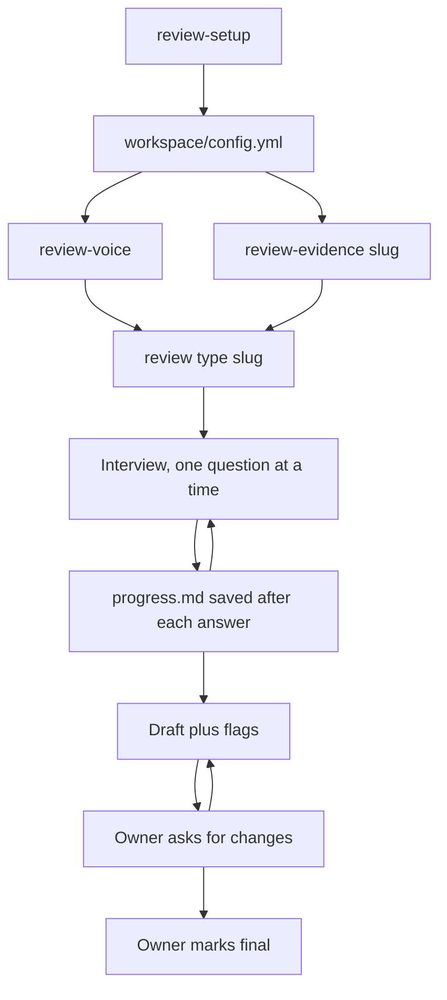

# How it works

Review Harness is a set of markdown files that tell an AI harness how to interview you and write up what you said. There is no code path to follow, so the best way to understand it is to follow the files. This page walks the flow from setup to a final review, then explains the pieces that make it hold together across sessions.

## The flow

Everything starts with `review-setup` ([setup.md](../harness/workflows/setup.md)). It asks one round of questions, who you are, who you review this cycle, which format each review uses, and writes `workspace/config.yml` plus a folder per review under `workspace/cycles/<cycle>/`. It never overwrites, so it is safe to rerun when a new cycle starts.

Two optional steps come next, in either order. `review-voice` ([voice.md](../harness/workflows/voice.md)) reads what you have dropped into `workspace/voice/samples/` and writes `workspace/voice/profile.md`, a description of how you write with quotes from your own text. `review-evidence <slug>` ([evidence.md](../harness/workflows/evidence.md)) reads the work systems you have access to and writes `evidence.md` for one subject. Both make the interview better. Neither is required.

Then `review <type> <slug>` ([review.md](../harness/workflows/review.md)) runs the interview. One question at a time, one or two follow-ups, a summary you confirm, a save to `progress.md`. When every question is answered or skipped, the harness drafts `review.md`, checks the draft against the checklist in [principles.md](../harness/principles.md), and shows you the text and the flags together. You ask for changes, it applies them exactly, and when you say it is final the draft marker comes off and the status flips.

## What each workspace file is for

| File | Who writes it | What it holds |
|---|---|---|
| `config.yml` | setup, then you | Your name, language, handles, the current cycle, the people and the reviews. |
| `voice/samples/` | you | Past reviews and other writing of yours. Input for the voice workflow. |
| `voice/profile.md` | voice workflow | How you write, with verbatim quotes. Read before every draft. |
| `people/<slug>.md` | setup, then you | Background on one subject: role, history, things you want to remember. |
| `formats/<type>.md` | you, optional | Your company's questions. Wins over `harness/formats/<type>.md`. |
| `cycles/<cycle>/<slug>/progress.md` | review workflow | Interview state: status, ticked questions, confirmed notes, draft history. |
| `cycles/<cycle>/<slug>/evidence.md` | evidence workflow | What the systems show, themed and linked, plus prompts for the interview. |
| `cycles/<cycle>/<slug>/notes.md` | you | Anything you drop in by hand during the cycle. |
| `cycles/<cycle>/<slug>/review.md` | review workflow | The draft, then the final review. |

The skeletons for all of these are in [harness/templates/](../harness/templates/).

## Resume: progress.md is the state

There is no session state anywhere else. After each confirmed answer the harness ticks the question in `progress.md`, appends the notes under `## Notes`, and sets `updated:`. If the session dies or you close the laptop, nothing is lost past the last confirmed answer.

When you run `review` again, the workflow reads `progress.md` first, summarises the answered questions in three lines, and continues from the first unticked one. If a draft exists it goes straight to iteration. `review-status` works the same way: one file per folder, one table.

You can edit `progress.md` by hand. If you remember something on the train, add it under the right question and the next session will use it.

## How evidence feeds the interview

The evidence workflow does not write reviews. It writes `evidence.md`: a volume table, themes with a link on every line, dated moments, and one or two candidate prompts per question in the format. The interview uses those prompts to make questions concrete. "The Bramble migration or the on-call rewrite, which one and why?" gets a better answer than "What are you proud of?".

Evidence is a prompt, not an answer. If you do not pick something up, it does not go into the review, except as a clearly marked suggestion in the draft notes so you can cut it. See [evidence.md](./evidence.md) for setup per source and [privacy.md](./privacy.md) for what it reads.

## The voice profile sits on top of the rules

[principles.md](../harness/principles.md) holds rules that apply to every review in every language: paragraphs not bullets, specific not generic, no em dashes, no AI vocabulary, no invented content. They are the floor.

`workspace/voice/profile.md` is what makes the draft sound like you rather than like a careful stranger. It quotes your own sentences: how you open an answer, how you phrase a hard point, what you say instead of "I think", which words you never use. The review workflow reads both before drafting. The profile can add to the rules, never relax them. A profile that says you love em dashes will not get you em dashes.

Without a profile the draft follows the floor and sounds like it. That is why the review workflow suggests `review-voice` first, and why it does not block if you skip it.

## The owner is in charge

This is the rule everything else depends on, so here is what it means in practice.

The harness asks; you answer. It never fills an answer in for you. If you say "skip", the question is skipped and the review says less. If you say "that is not how I would put it", it asks how you would put it and uses that. If it offers an evidence-based prompt and you say "no, that was mostly Priya's work", the prompt is dropped without argument.

During iteration it applies your changes exactly and touches nothing else. If you push back on a flag it raised, the flag goes away. If you ask what it thinks, it answers in a sentence or two and then does what you decide.

And only you mark a review final. The harness will say when it thinks the draft is ready. It will never set `status: final` on its own, and it will never commit, push or send anything unless asked.

Next: [privacy.md](./privacy.md), [customizing.md](./customizing.md), [evidence.md](./evidence.md).
